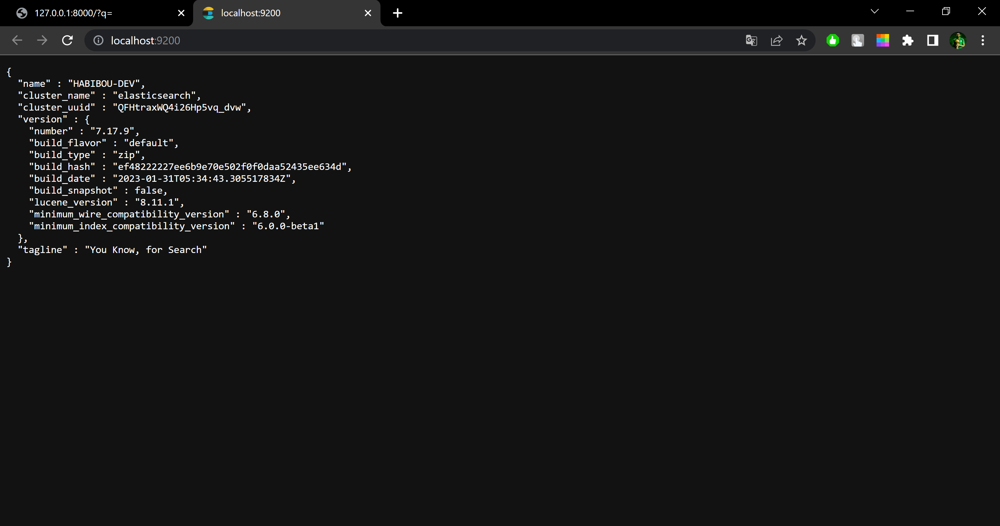

# search-by-elasticsearch-with-Django
Search-by-Elasticsearch-with-Django is a powerful integration that combines the Django web framework with Elasticsearch, enabling efficient and flexible search functionality. It allows developers to harness Elasticsearch's robust search capabilities, including full-text search, filtering, and aggregations, within their Django applications, enhancing the search experience for users.

### Install elasticsearch :
        https://www.elastic.co/fr/downloads/past-releases/elasticsearch-7-17-9
### Run ELasticsearch from the command line:
        ./bin/elasticsearch

### Run Activate the virtual environment:
        env/Scripts/activate
### Install elasticsearch in  virtual environment :
        pip install elasticsearch
### Install elasticsearch-dsl  in  virtual environment :
        pip install elasticsearch-dsl
### Install django-elasticsearch-dsl and configure in  virtual environment :
        pip install django-elasticsearch-dsl
### Configure ELasticsearch into settings.py:

### Run server Django in virtual environment :
        py manage.py runserver

